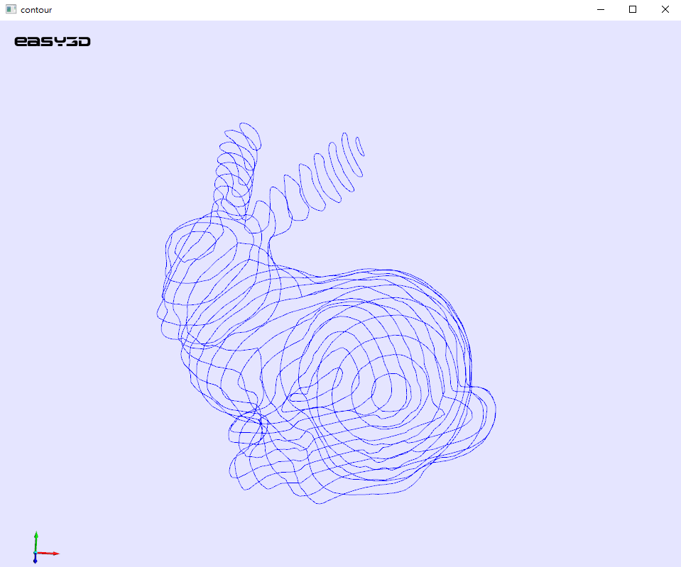

# draw_ContourLine
使用CGAL的heatmethod库和easy3D库，画出mesh的等高线

- CGAL heatmethod ： https://cgal.geometryfactory.com/CGAL/doc/master/Heat_method_3/index.html#Chapter_HeatMethod

- easy3D：https://github.com/LiangliangNan/Easy3D


添加起始点：

```c++
vertex_descriptor source2(168);
hm.add_source(source2);
```


设置等高线数量：

```c++
int quantity = 20;
```


 
